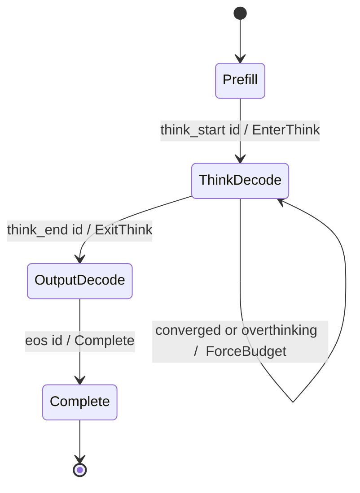
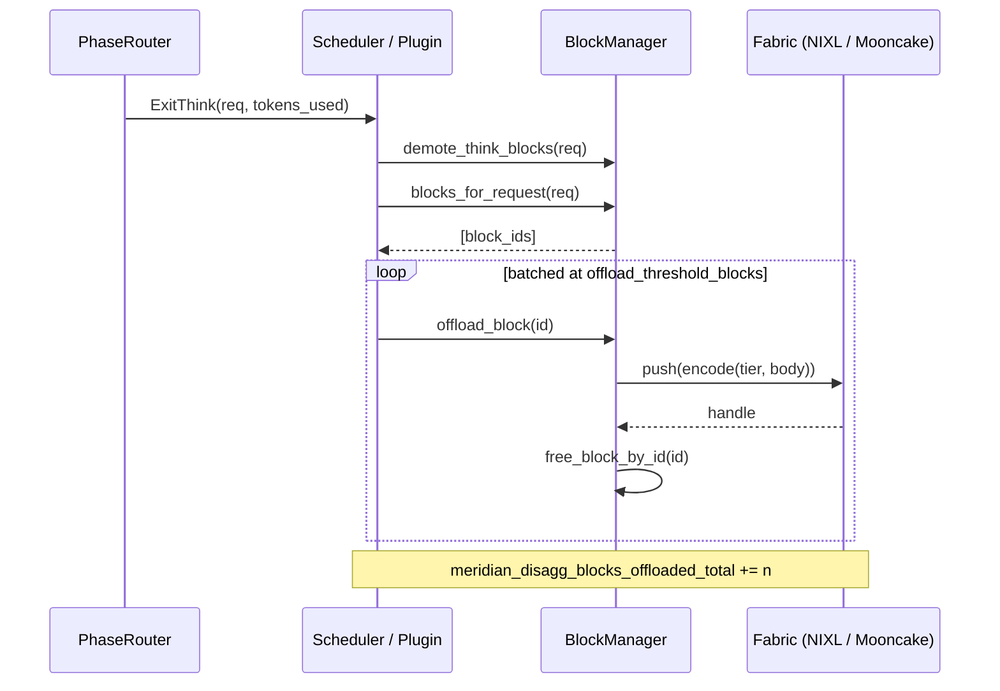

# Architecture

```text
Incoming requests
      │
      ▼
┌─────────────────────────────────────────────────────────┐
│                    Meridian Daemon                        │
│                                                           │
│  ┌──────────────┐    ┌────────────────────────────────┐  │
│  │   Prefill    │───▶│        Phase Router             │  │
│  │   Executor   │    │  (token stream state machine)   │  │
│  └──────────────┘    └───────────┬─────────────────────┘  │
│                                  │                         │
│                    ┌─────────────┴──────────────┐          │
│                    │                            │          │
│        ┌───────────▼──────────┐  ┌─────────────▼───────┐  │
│        │   Think-Decode       │  │   Output-Decode      │  │
│        │   Scheduler          │  │   Scheduler          │  │
│        │                      │  │                      │  │
│        │  TPOT: relaxed       │  │  TTOT: strict SLO    │  │
│        │  Batch: 2.5× larger  │  │  Batch: standard     │  │
│        │  Entropy probe live  │  │  Stream priority     │  │
│        │  Budget force ready  │  │                      │  │
│        └──────────┬───────────┘  └────────┬─────────────┘  │
│                   │                       │                 │
│                   └──────────┬────────────┘                 │
│                              │                              │
│               ┌──────────────▼─────────────┐               │
│               │   Phase-Aware KV Block Mgr  │               │
│               │                             │               │
│               │  Tier 0: ThinkComplete      │               │
│               │  Tier 1: ThinkActive        │               │
│               │  Tier 2: OutputCritical     │               │
│               └─────────────────────────────┘               │
└────────────────────────────┬────────────────────────────────┘
                             │
                        vLLM worker
                    (decode kernel, KV store)
```

## Phase state machine

The Phase Router advances each request through this machine on every decoded
token. `ForceBudget` is emitted as a side effect (the request stays in
`ThinkDecode` until `</think>` is observed or injected).



## Disaggregated offload sequence

When a fabric is configured, `ExitThink` triggers a batched offload of the
request's think-complete blocks. Each offloaded block is framed, pushed to the
fabric, and its local slot is reclaimed (see [ADR-0006](adr/0006-disagg-kv-transfer.md)).



## Components

### Phase Router

**Inputs**: raw token IDs emitted per step, per request ID.  
**Outputs**: `PhaseEvent` stream (`EnterThink`, `ExitThink`, `ForceBudget`,
`BudgetForceReason`).  
**Hot-path constraint**: O(1) per token, zero heap allocation in the common
case. Backed by `DashMap` with sharded locking — see [ADR-0003](adr/0003-dashmap-rationale.md).  
**Failure mode**: if a request is never reaped, its entry leaks in the map.
`reap_stale_older_than(Duration)` removes entries older than a wall-clock
threshold; the vLLM plugin calls this on every batch step.  
**Observability**: `meridian.phase_router.tracked_requests` gauge.

Source: [`crates/meridian-core/src/phase_router.rs`](https://github.com/angelnicolasc/meridian/blob/main/crates/meridian-core/src/phase_router.rs).

---

### Dual-Queue Scheduler

**Inputs**: a pool of pending requests tagged by their current phase.  
**Outputs**: two ordered lists — one output-phase batch (drains first), one
think-phase batch (fills remaining capacity).  
**Hot-path constraint**: a single pass over both queues per `schedule_batch`
call. No per-token work.  
**Invariant**: output-phase requests are never starved. The think queue only
receives tokens after the output queue is drained or SLO-budget-limited.  
**Failure mode**: if `think_batch_multiplier` is set too high relative to
GPU capacity, output ITL variance increases. `meridian.queue_depth{queue=think}`
growing without accompanying `budget_force_triggered` activity is the signal.  
**Observability**: `meridian.schedule_batch.duration_ns`, `meridian.queue_depth`.

See [ADR-0001](adr/0001-dual-queue-rationale.md) for the design alternative this rejects.

Source: [`crates/meridian-core/src/scheduler.rs`](https://github.com/angelnicolasc/meridian/blob/main/crates/meridian-core/src/scheduler.rs).

---

### Phase-Aware Block Manager

**Inputs**: `allocate(request_id, tier)` and `evict_for(required_blocks)` calls
from the vLLM KV allocator path.  
**Outputs**: block IDs; eviction decisions ordered by tier.  
**Invariant**: `ThinkComplete` blocks are always evicted before `ThinkActive`;
`OutputCritical` blocks are evicted last and only under sustained pressure.  
**Failure mode**: `OutputCritical` eviction is a user-visible degradation event
(stream stutter). Every such event increments `meridian.output_critical_eviction`.
Alert on any increment in a 5-minute window.  
**Disagg surface**: `offload_block(block_id)` and `ingest_block(bytes, tier)` are
available when a disagg fabric is configured — see [ADR-0006](adr/0006-disagg-kv-transfer.md).  
**Observability**: `meridian.output_critical_eviction` counter.

Source: [`crates/meridian-core/src/block_manager.rs`](https://github.com/angelnicolasc/meridian/blob/main/crates/meridian-core/src/block_manager.rs).

---

### Entropy Probe

**Inputs**: raw logit vector (fp32, bf16, or fp16) from a completed forward pass.  
**Outputs**: `EntropySignal` — per-token entropy (nats), EAT value, EAT EMA,
EAT EMA variance, RPDI local/global ratio.  
**Hot-path constraint**: designed to run on a dedicated secondary CUDA stream;
must not stall the generation stream. In Sprint 0 both paths use the NumPy
reference; `python/meridian/_backends/cuda.py` defines the CUDA backend
interface and delegates to CPU until Sprint 1 wires it to the Rust kernels in
`crates/meridian-kernels/`.  
**Invariant**: CPU and CUDA backends must agree within `atol=1e-5` on the same
logit vector. Enforced by `crates/meridian-kernels/tests/kernel_correctness.rs`.  
**Failure mode**: if the kernel returns `Unavailable`, the system falls back to
count-only budget forcing (`hard_cap` on every termination). This is safe but
loses entropy-driven adaptivity.  
**Observability**: signals surface through `meridian.budget_force_reason`.

Sources:
- [`crates/meridian-kernels/`](https://github.com/angelnicolasc/meridian/tree/main/crates/meridian-kernels) — CUDA kernels + C FFI.
- [`python/meridian/entropy_probe.py`](https://github.com/angelnicolasc/meridian/blob/main/python/meridian/entropy_probe.py) — Python facade + EMA state.
- [`python/meridian/_backends/`](https://github.com/angelnicolasc/meridian/tree/main/python/meridian/_backends) — CPU and CUDA backends.

---

### vLLM Plugin

**Inputs**: vLLM `Scheduler` instance at attach time; `schedule_batch` calls
at runtime.  
**Outputs**: reordered batch with output-phase requests drained first; injected
`</think>` tokens on budget-force events; disagg offload calls on `ExitThink`.  
**Constraint**: no vLLM fork required. The plugin wraps the existing scheduler
via attribute delegation; unknown attributes fall through to the wrapped
scheduler so vLLM internals work unmodified. `MeridianSchedulerPlugin.attach()`
is a classmethod that installs the plugin as `engine.scheduler[0]` — no
separate `detach()` is provided in v0.1.x.  
**Failure mode**: if the plugin raises during `schedule_batch`, it re-raises
to the vLLM worker, which surfaces as a serving error for that batch. Errors
in the disagg offload path are caught and logged; they do not block generation.  
**Observability**: all Phase Router and Block Manager metrics
(`meridian.block_manager.*`, `meridian.queue_depth`, `meridian.schedule_batch.*`),
plus `meridian_disagg_blocks_offloaded_total` and `meridian_vocab_fallback_total`
emitted by the plugin (Prometheus, and OTLP when `[telemetry]` is enabled).

Source: [`python/meridian/vllm_plugin.py`](https://github.com/angelnicolasc/meridian/blob/main/python/meridian/vllm_plugin.py).
