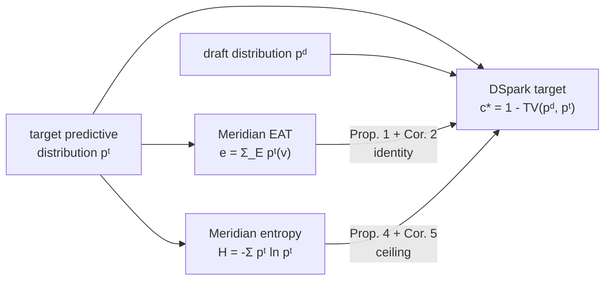

# Phase-Conditioned Speculative Decoding

| | |
|---|---|
| **Status** | Structural result — **no measurement** |
| **Work items** | MER-P0.1, MER-P0.2, MER-P0.3 |
| **Author** | angelnicolasc |
| **Date** | 2026-08-07 |
| **Code** | [`meridian_core::dspark_bridge`](https://docs.rs/meridian-core/latest/meridian_core/dspark_bridge/index.html) |
| **Decision record** | [ADR-0009](../adr/0009-phase-conditioned-speculation.md) |

> **Read this first.** This note contains no measured acceptance rate, and the
> code it describes cannot produce one. It reports a documented mismatch, a
> proof relating two previously-unconnected signals, and a scheduler hook built
> so it cannot act on the unproven part. The empirical question is stated
> precisely and left open. See [What I am not claiming](#8-what-i-am-not-claiming).

## 1. The three-way split

Everything below sorts into exactly one of these rows. Keeping them apart is the
point of the note.

| | Statement | Basis |
|---|---|---|
| **Verified** | DeepSpec's released Qwen3 drafters were trained on data its target models generated **in non-thinking mode**. | The repository says so, verbatim (§2). |
| **Proved** | Meridian's EAT signal *is* the DSpark confidence head's supervision target for a specific drafter; and target entropy ceilings the single-step acceptance of any deterministic drafter. | §5, with proofs and tests. |
| **Predicted, unmeasured** | Draft acceptance during the think phase is lower than during the output phase for these checkpoints. | Nothing. This is the open question. |

## 2. The documented mismatch

[DeepSpec](https://github.com/deepseek-ai/DeepSpec) is DeepSeek's open-source
toolkit for training and evaluating speculative-decoding drafters. It ships
ready-to-use checkpoints — Eagle3, DFlash and DSpark variants — for
`Qwen/Qwen3-4B`, `Qwen3-8B`, `Qwen3-14B` and `google/gemma-4-12B-it`.

Its README states that each checkpoint was trained on
[open-perfectblend](https://huggingface.co/datasets/mlabonne/open-perfectblend)
data generated by its corresponding target model **in non-thinking mode**.

Qwen3 exposes an explicit `enable_thinking` toggle that produces a delimited
reasoning span before the final answer. Production traffic for a reasoning model
runs with it on. The drafters were trained with it off.

That is a distribution mismatch between how a drafter was trained and how the
target it drafts for is actually used. It is documented, not inferred — which is
what makes it a usable foundation rather than a hunch.

It is also **not yet a defect**. Whether the mismatch costs anything depends on
whether the two phases are statistically different enough for a drafter to
notice, and nobody has published a phase-segmented measurement. That is the gap
this work is aimed at.

## 3. What DSpark's confidence head computes (MER-P0.1)

DSpark pairs a parallel draft backbone with a lightweight sequential head, and
attaches a **confidence head** that scores each drafted position's chance of
surviving verification. For drafted position `k`:

```text
c_k = σ( wᵀ [ h_k ; W₁[x_{k-1}] ] )                        (DSpark Eq. 7)
```

where `h_k` is the backbone hidden state and `W₁[x_{k-1}]` a Markov embedding of
the previously drafted token. `c_k ∈ (0,1)` is the probability that position `k`
survives *given every preceding draft token was accepted*, so prefix survival is
the cumulative product `S_k = ∏_{i ≤ k} c_i`.

The interesting part is the supervision signal. The head is not trained against
sampled accept/reject outcomes; it regresses an **analytical** target:

```text
c*_k = 1 - ½ ‖ pᵈ_k - pᵗ_k ‖₁                              (DSpark Eq. 8)
```

`½‖·‖₁` is total variation distance, so `c* = 1 - TV(pᵈ, pᵗ)` — exactly the
single-step acceptance probability of speculative sampling under the standard
accept/reject rule. Training is position-weighted binary cross-entropy against
that target (Eq. 11), followed by sequential temperature scaling that minimises
expected calibration error of the *cumulative product*, one position at a time.

Downstream, a prefix scheduler chooses verification depth per request by
maximising throughput `Θ = τ · SPS(B)`: accepted tokens per cycle times
steps-per-second at the resulting batch size.

**The one line that matters for what follows:** the confidence head is a learned
estimator of `1 - TV(pᵈ, pᵗ)`.

## 4. What Meridian's EAT/RPDI signal computes (MER-P0.2)

Meridian's entropy probe reads the target's predictive distribution `pᵗ` at each
decode step and emits
[`EntropySignal`](https://docs.rs/meridian-core/latest/meridian_core/types/struct.EntropySignal.html):

```text
e_k = Σ_{v ∈ E} pᵗ_k(v)          EAT: mass on the think-end token set E
H_k = -Σ_v pᵗ_k(v) ln pᵗ_k(v)    Shannon entropy, nats
```

`e_k` is smoothed into `μ_k = α e_k + (1-α) μ_{k-1}`, with a companion
second-moment EMA so `Var[e] ≈ ν_k - μ_k²` is available without keeping a sample
window. RPDI compares a short-window EMA of the transition indicator
`1[H_k > θ]` against its running global mean. Both feed one decision: when to
force `</think>`.

**The one line that matters:** EAT is the target's probability mass on a
designated token set.

## 5. Where the two signals actually meet (MER-P0.3)

Both quantities are functionals of the same object. That much is obvious. The
non-obvious part is that they are *the same functional*, evaluated for different
reasons.



Every result below has a test in
[`confidence_model.rs`](https://github.com/angelnicolasc/meridian/blob/main/crates/meridian-core/src/dspark_bridge/confidence_model.rs).

### Proposition 1 — point-mass identity

For a deterministic drafter `pᵈ = δ_x̂`, the analytical acceptance rate is the
target's mass on the drafted token: `c* = pᵗ(x̂)`.

*Proof.* `‖δ_x̂ - pᵗ‖₁ = (1 - pᵗ(x̂)) + Σ_{v≠x̂} pᵗ(v) = 2(1 - pᵗ(x̂))`. Halve and
subtract from one. ∎

### Corollary 2 — EAT *is* an acceptance rate

Meridian's `e_k` is precisely the DSpark supervision target `c*_k` for the
drafter that always proposes the think-end token.

This is the result the whole project hangs on. Meridian computes EAT to decide
when a model has finished reasoning. DSpark computes `c*` to decide how deep to
verify. They are the same number, for a particular drafter, arrived at from
opposite directions.

### Proposition 3 — EAT ceilings any boundary-supported drafter

If `supp(pᵈ) ⊆ E`, then `c* ≤ e`, with equality iff `pᵈ(v) ≥ pᵗ(v)` for all
`v ∈ E` — which holds automatically when `E` is a singleton.

*Proof.* `TV(pᵈ,pᵗ) = sup_A |pᵈ(A) - pᵗ(A)| ≥ pᵈ(E) - pᵗ(E) = 1 - e`. ∎

### Proposition 4 — entropy brackets the target mode

Write `M = max_v pᵗ(v)` and let `V` be the vocabulary size. Then

```text
e^{-H}  ≤  M  ≤  p*(H, V)
```

where `p*` is the unique root on `[1/V, 1]` of `H = H_b(p) + (1-p)·ln(V-1)`.

*Proof.* Lower: `H = -Σ p ln p ≥ -Σ p ln M = -ln M`. Upper: the right-hand side
is the maximum entropy attainable by any distribution over `V` symbols whose
largest mass is `p` — a spike of `p` over a uniform tail — and it is strictly
decreasing in `p`. For the observed `H` to be feasible, `M ≤ p*`. ∎

### Corollary 5 — the actionable one

Every deterministic drafter satisfies `c* = pᵗ(x̂) ≤ M ≤ p*(H, V)`.

High target entropy at a step is a **proof** that no deterministic drafter can be
accepted often there — regardless of which drafter is deployed, computable from a
signal Meridian already has, with no access to the drafter at all.

Note the direction carefully. This is a *ceiling*, so it can only ever justify
drafting **less**. It can never justify drafting more. That asymmetry is the
safety property the hook in §6 is built on.

### The bracket, numerically

For Qwen3's vocabulary (`V = 151,936`, `ln V = 11.93`):

| `H` (nats) | floor `e^{-H}` | ceiling `p*(H, V)` | best `γ` under the §6 cost model |
|---:|---:|---:|---:|
| 0.5 | 0.6065 | 0.9695 | 7 |
| 2.0 | 0.1353 | 0.8655 | 7 |
| 4.0 | 0.0183 | 0.7148 | 5 |
| 8.0 | 0.0003 | 0.3854 | 2 |
| 11.0 | ~0 | 0.1065 | 1 |
| 11.93 (uniform) | ~0 | 0.000007 | 1 |

The ceiling is worth having: at `H = 8` it proves no deterministic drafter
exceeds 39 % single-step acceptance, which is enough to cut draft depth from
seven to two on the cost model below. The floor is much weaker and is retained
only as a diagnostic — it describes headroom for a hypothetical target-aware
drafter, not a guarantee for a deployed one.

## 6. What this licenses in the scheduler

`c*` depends on **both** `pᵈ` and `pᵗ`. Every Meridian signal depends on `pᵗ`
alone. So Meridian can *bound* draft acceptance from what it already computes,
and can never *predict* it without running the drafter.

That single sentence determines the entire design of the shipped hook:

- **Uncalibrated** — the state it ships in, and the state it stays in until
  someone runs Phase 1 — the hook may only shrink the operator's configured
  draft depth, and only where Corollary 5 proves a deeper draft cannot pay off.
- **Calibrated** — only reachable by supplying measured per-phase acceptance
  rates *together with the provenance of the run that produced them* — the hook
  may also raise depth, and conditions on phase.

The depth choice maximises a throughput proxy with the same shape as DSpark's
objective, minus the hardware cost table:

```text
Θ(γ) = τ(a, γ) / (draft_us·γ + verify_fixed_us + verify_token_us·γ)
τ(a, γ) = (1 - a^{γ+1}) / (1 - a)
```

`τ` assumes i.i.d. per-position acceptance, which is the weakest link in the
model: real drafters decay along the block, which is exactly why DSpark has a
sequential head and why DeepSpec reports `accept_rates_by_position`. `τ` is a
first-order planner, not a claim about measured behaviour.

Provenance is enforced by the type system rather than by discipline. A synthetic
trace cannot become a published claim without deleting code:

```rust
let report = ledger.report();          // computes fine on synthetic data
assert!(report.verdict(0.0) == HypothesisVerdict::Supported);
assert!(report.into_measured_claim().is_err());   // ... but cannot be promoted
```

Configuration is gated the same way: there is no way to write acceptance rates
into `meridian.toml` without also naming the harness, checkpoint, target model,
thinking-mode flag and date of the run that produced them.

## 7. What shipped

| Piece | Where | GPU? |
|---|---|---|
| Formal model + the five results, with tests | `dspark_bridge::confidence_model` | No |
| Phase-conditioning hook | `dspark_bridge::hook` | No |
| Phase-segmented acceptance ledger + Welch test | `dspark_bridge::ledger`, `::stats` | No |
| Provenance gate | `dspark_bridge::provenance` | No |
| Synthetic trace fixtures (clean / ambiguous / all-think / all-output) | `tests/dspark_bridge_synthetic.rs` | No |
| Python bindings | `meridian._meridian` | No |
| Harness instrumentation gap analysis | [note](deepspec-harness-instrumentation.md) | No |
| Phase 1 protocol | [note](phase-1-protocol.md) | Yes — **deferred** |

## 8. What I am not claiming

Following the precedent this project set for itself:

- **I have not measured a phase-dependent acceptance gap.** No number in this
  note, the code, or the test suite is a measurement. The `dspark_bridge` module
  is deliberately incapable of emitting one without hardware in the loop.
- **I have not shown the mismatch costs anything.** A drafter trained on
  non-thinking text may generalise to thinking text perfectly well. The
  hypothesis is falsifiable and a null result is a publishable outcome.
- **I have not shown Meridian's signals can predict DSpark acceptance.** §6 says
  precisely the opposite: they bound it, one-sidedly, and the shipped hook is
  restricted to that one side.
- **The `τ` model is not validated.** The i.i.d. assumption is known to be wrong
  in the direction that matters (suffix decay). It plans; it does not describe.
- **The cost-model defaults are placeholders.** `draft_token_us`,
  `verify_fixed_us` and `verify_token_us` produce sane relative ordering. They
  are not a measurement of any hardware and are documented as such.
- **The straddle problem is unresolved by data.** A verification step commits
  several tokens, so a step can span the `</think>` boundary. The ledger makes
  the attribution policy explicit and reports the straddle rate, but which
  policy is *right* is an empirical question Phase 1 has to answer.

## 9. References

- Cheng, Yu, Shao et al. *DSpark: Confidence-Scheduled Speculative Decoding with
  Semi-Autoregressive Generation.* DeepSeek-AI and Peking University.
  [arXiv:2607.05147](https://arxiv.org/abs/2607.05147)
- [`deepseek-ai/DeepSpec`](https://github.com/deepseek-ai/DeepSpec) — training and
  evaluation toolkit. MIT licensed; `NOTICE` records Apache-2.0 portions adapted
  from [SpecForge](https://github.com/sgl-project/SpecForge) and MIT-licensed
  design input from [DFlash](https://github.com/z-lab/dflash). See the
  [instrumentation note](deepspec-harness-instrumentation.md) for which files
  that affects.
- Leviathan, Kalman, Matias. *Fast Inference from Transformers via Speculative
  Decoding.* ICML 2023 — origin of the `τ(a, γ)` expected-accepted-length result.
- Qwen3 model family documentation — `enable_thinking` chat-template toggle.
- Meridian, *"Reasoning models emit two workloads. Your scheduler sees one."* —
  the thesis this note extends one level down the stack.

*External facts were verified against live sources on 2026-08-07. Re-verify
before republication.*
